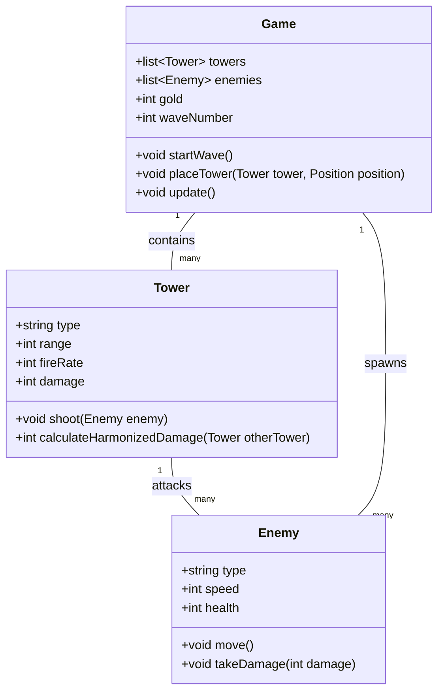

**Naam:** Mo Kharboutli  
**Klas:** SD2B  
**Datum:** 9/8/2025  

---

## 🎮 Titel en Elevator Pitch

**Titel:** (Nog te bepalen)

**Elevator Pitch:**  
Stel je voor: een *tower defense*-game waarin muziekinstrumenten je torens zijn. Door de juiste instrumenten te combineren, kun je hun geluiden laten harmoniseren — en zo meer damage doen! Gebruik de kracht van muziek om je vijanden te verslaan.

---

## 💡 Wat maakt deze Tower Defense uniek?

Deze tower defense is uniek omdat de speler niet alleen strategisch torens moet plaatsen, maar ook moet nadenken over **muzikale harmonie**.  
Gebruik je bijvoorbeeld alleen drums, dan doen ze minder damage. Combineer je drums met een gitaar, dan harmoniseren ze en doen ze samen **meer schade**.  

De speler moet dus zowel tactisch als muzikaal slim spelen.

---

## 🧱 Design en UI

### 🎨 Schets van de layout en interface

---

## 🏰 Torens

| Toren  | Eigenschap | Bereik | Schietsnelheid | Damage |
|---------|-------------|--------|----------------|---------|
| **Drums** | Groot bereik, gebalanceerde toren | Groot | Medium | Medium |
| **Guitar** | Snel schietende toren | Klein | Hoog | Medium |
| **Piano** | Ondersteunende toren | Medium | Hoog | Laag |

---

## 👾 Vijanden

| Vijand | Snelheid | Health | Beschrijving |
|--------|-----------|---------|---------------|
| **Quarter Note** | Medium | Medium | Standaardvijand |
| **Eighth Note** | Hoog | Laag | Snelle, zwakke vijand |
| **Joined Eighth Note** | Laag | Hoog | Trage, sterke vijand |

---

## 🔁 Gameplay Loop

1. Plaats torens strategisch op het veld.  
2. Versla vijanden om goud te verdienen.  
3. Gebruik goud om nieuwe torens te kopen.  
4. Level up en kies **kaarten** voor passieve buffs.  
5. Harmoniseer je torens voor maximale damage.  

---

## 📈 Progressie

- Elke **wave** wordt moeilijker: vijanden krijgen meer health en bewegen sneller.  
- Spelers verdienen **ervaring** en **kaarten** om hun strategie te verbeteren.  

---

## 🛠️ Planning per Sprint en Mechanics

| Sprint | Mechanics / Features |
|--------|-----------------------|
| **Sprint 1** | Vijandbeweging over pad, speler kan doodgaan, menu toevoegen |
| **Sprint 2** | Torens plaatsen, harmonisatie, muziek, vijanden doden |
| **Sprint 3** | Waves starten, XP en gold systeem, torens kopen, kaarten kiezen |

---

## 🌟 Inspiratie

**Inspiratie:**  
*Kingdom Rush* — een leuke, stabiele en goed uitgebalanceerde tower defense-game die als basis dient voor het ontwerp en tempo van dit project.

---

## 📚 Toekomstige toevoegingen

- Geluidseffecten per instrumenttoren  
- Meer harmonisatiecombinaties  
- Boss waves  
- Visuele muziek-effecten bij combo’s  
- Upgradesysteem voor torens  

---

https://trello.com/b/EunlwuR6/tower-defense

